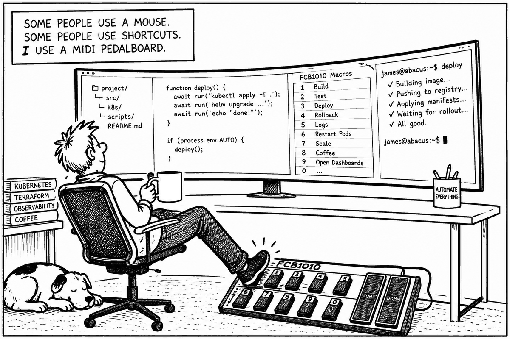

# fcbnerd



Use a MIDI foot controller as an extra keyboard for your Mac. `fcbnerd`
connects to your MIDI sources and either runs a shell command when a
footswitch or pedal sends a message you've bound, or prints one JSON object
per line for every message so another program can decide what a stomp
means.

```console
$ fcbnerd -q --bind '1:20:127=open ~/Downloads' --bind 'pc:1:0=say hello'
```

Or stream everything for another program to handle:

```console
$ fcbnerd
{"type":"connected","source":"UM-ONE","time":"2026-09-14T20:01:00.120Z"}
{"type":"pc","channel":1,"program":0,"source":"UM-ONE","time":"2026-09-14T20:01:02.345Z"}
{"type":"cc","channel":1,"controller":27,"value":84,"source":"UM-ONE","time":"2026-09-14T20:01:03.910Z"}
```

Built for the Behringer FCB1010, but nothing in it is FCB1010-specific: any
CoreMIDI source works.

## Why a command-line tool instead of an app

Anything that acts on your Mac (pressing keys, switching Spaces, running
scripts) needs permissions that sandboxed apps can't get, and every user wants
a different set of actions. `fcbnerd` only reads MIDI, which needs no
permissions, and leaves the actions to your shell or to tools that already
have the access: [Hammerspoon](https://www.hammerspoon.org), Keyboard
Maestro, a Node or Python script.

## Install

```sh
brew install JamesRyanATX/tap/fcbnerd
```

Or from source (Xcode or the Swift toolchain, macOS 13+):

```sh
swift build -c release
cp .build/release/fcbnerd /usr/local/bin/
```

## Usage

```
fcbnerd [listen] [--source NAME] [--format json|text] [--bind BINDING]... [--quiet] [--shell PATH]
fcbnerd list [--format json|text]
fcbnerd simulate
```

- **`listen`** (default) connects to every MIDI source, or only those whose
  name contains `--source`, and streams events until interrupted. It follows
  hotplug: unplug the interface mid-set and plug it back in, and the stream
  carries on with `disconnected` / `connected` lines.
- **`list`** prints the sources available right now.
- **`simulate`** publishes a virtual MIDI source named `fcbnerd simulator`
  that plays synthetic presses, a pedal sweep and a sysex message on a loop.
  Run it in one terminal and `fcbnerd` in another to build a consumer with no
  pedal attached.
- **`--format text`** prints aligned columns for eyeballing, including a
  `bind=` pattern for each message you can bind. Scripts should use the
  default JSON; the text layout may change.
- **`--bind`** runs a command when a message matches; see below.
- **`--quiet`** stops printing events, leaving only the bound commands.
- **`--shell PATH`** picks the shell that runs bound commands (default
  `/bin/sh`).

Status messages go to stderr; stdout carries only events. Each line is
flushed as soon as it's written, so pipes see events immediately.

## Binding commands

First find out what your pedal sends. Run `fcbnerd -f text` and press the
switch:

```console
$ fcbnerd -f text
16:30:41.115  pc                channel=1 program=7  bind=pc:1:7  [USB MIDI Interface]
16:30:41.115  cc                channel=1 controller=20 value=127  bind=1:20:127  [USB MIDI Interface]
```

Then bind a command to that pattern:

```sh
fcbnerd --bind '1:20:127=open ~/Downloads'
```

A binding is `PATTERN=COMMAND`. Everything after the first `=` is the command,
so it can contain `=` and `:` itself. Use `--bind` as many times as you like.
Every binding that matches a message starts, in the order given, and they run
at the same time.

| Pattern | Matches |
|---|---|
| `CHANNEL:CONTROLLER:VALUE` | Control change, e.g. `1:20:127`. `cc:1:20:127` also works. |
| `pc:CHANNEL:PROGRAM` | Program change, e.g. `pc:1:7`. |

Any number can be `*`: `1:27:*` is every value of controller 27 on channel 1,
which is how you bind an expression pedal.

Commands run in the background through `/bin/sh -c`, or the shell you give
with `--shell`. Their stdin is `/dev/null`. Their stdout goes to fcbnerd's
stderr, so it can't corrupt the event stream; with `--quiet` it goes to
stdout. They see these environment variables:

| Variable | |
|---|---|
| `MIDI_TYPE` | `cc` or `pc` |
| `MIDI_CHANNEL` | 1–16 |
| `MIDI_CONTROLLER`, `MIDI_VALUE` | For `cc` |
| `MIDI_PROGRAM` | For `pc` |
| `MIDI_SOURCE` | MIDI source name |

```sh
# Expression pedal sets output volume
fcbnerd -q --bind '1:27:*=osascript -e "set volume output volume $((MIDI_VALUE * 100 / 127))"'
```

How commands run:

- **Every stomp runs the command.** Two quick presses run it twice, even if
  the first run hasn't finished. Every matching message starts a shell, so
  keep broad patterns like `*:*:127` or `pc:*:*` away from noisy devices.
- **Pedal sweeps don't pile up.** For a binding with a `*` value, only one
  copy of the command runs at a time for each control (channel and
  controller). While it runs, only that control's newest value is kept, and
  it runs next. A sweep sends dozens of values a second, so this keeps the
  number of shells down and still ends on the pedal's final position. If the
  command is still running after 5 seconds, fcbnerd says so on stderr.
- **Failures go to stderr.** A command that exits non-zero prints its binding
  and exit status there.
- **Stopping fcbnerd stops the commands.** Ctrl+C, `kill`, closing the
  terminal or a closed stdout sends SIGTERM to any command still running,
  including processes it started.

**Shell functions.** Functions and aliases from your interactive shell
aren't loaded in `sh -c`. In bash, export a function to make it visible
(macOS's `/bin/sh` is bash, so the default shell sees it):

```bash
greet() { say "preset $MIDI_PROGRAM"; }
export -f greet
fcbnerd -q --bind 'pc:1:*=greet'
```

zsh can't export functions. Put them in a file and source it with zsh:
`--shell /bin/zsh --bind 'pc:1:*=source ~/.fcbnerd.zsh && greet'`.

**No release events on the FCB1010.** A binding fires on the press and
nothing fires when you let go (see [FCB1010 notes](#fcb1010-notes)). For
on/off behavior, keep state in the command, for example by toggling a file
in `/tmp`.

## Output

`fcbnerd listen` prints one JSON object per line. Every object has `type`,
`source` (the MIDI source's display name) and `time` (when fcbnerd received
the message: ISO 8601, UTC, milliseconds). Channels are 1–16; note,
controller, program, velocity and pressure values are the raw 0–127 MIDI
values.

| `type` | Extra fields | Notes |
|---|---|---|
| `pc` | `channel`, `program` | Program change. `program` is 0-based on the wire. |
| `cc` | `channel`, `controller`, `value` | Control change: switches and expression pedals. |
| `note_on` | `channel`, `note`, `velocity` | |
| `note_off` | `channel`, `note`, `velocity` | Also emitted for note-on with velocity 0. |
| `poly_pressure` | `channel`, `note`, `pressure` | |
| `channel_pressure` | `channel`, `pressure` | |
| `pitch_bend` | `channel`, `value` | 0–16383, center 8192. |
| `sysex` | `length`, `data` | `data` is lowercase hex including the `f0`…`f7` framing; `length` counts those bytes. |
| `connected` | | A source appeared and is being listened to. Always precedes that source's events. |
| `disconnected` | | A source went away. A message already in flight may still follow it. |

System real-time messages (MIDI clock and so on) and system common messages
(song position, MTC) are not emitted. New event types or fields may be added
in future versions; existing ones won't change meaning. Consumers should
ignore types and fields they don't recognize.

Read the stream promptly. If a consumer stops reading, fcbnerd queues events
in memory and delivers them all when reading resumes, so a stalled consumer
will act on a burst of stale presses.

`fcbnerd list --format json` prints a different shape, one line per source:
`{"type":"source","name":"UM-ONE","id":-1234567}`. `id` is the CoreMIDI
unique ID.

## Examples

**Shell + jq:** program 0 switches to the next Space, program 1 to the previous
one. This needs more than one Space, the "Move left/right a space" shortcuts
enabled (the default) in System Settings → Keyboard → Keyboard Shortcuts →
Mission Control, and for your terminal app both Accessibility permission and
Automation permission to control System Events. macOS asks for the Automation
permission the first time.

```sh
fcbnerd | jq --unbuffered -r 'select(.type == "pc") | .program' |
while read -r program; do
  case "$program" in
    0) osascript -e 'tell application "System Events" to key code 124 using control down' ;;
    1) osascript -e 'tell application "System Events" to key code 123 using control down' ;;
  esac
done
```

**Hammerspoon:** stream into Lua. Program 0 toggles play/pause, and an
expression pedal on CC 27 sets the output volume. Output can arrive in
partial chunks, so buffer until a newline. The path is for Apple Silicon;
Homebrew on Intel installs to `/usr/local/bin`.

```lua
local buffer = ""
fcbnerd = hs.task.new("/opt/homebrew/bin/fcbnerd", nil, function(_, stdout, _)
  buffer = buffer .. stdout
  for line in buffer:gmatch("([^\n]*)\n") do
    local event = hs.json.decode(line)
    if event and event.type == "pc" and event.program == 0 then
      hs.eventtap.event.newSystemKeyEvent("PLAY", true):post()
      hs.eventtap.event.newSystemKeyEvent("PLAY", false):post()
    elseif event and event.type == "cc" and event.controller == 27 then
      hs.audiodevice.defaultOutputDevice():setVolume(event.value / 127 * 100)
    end
  end
  buffer = buffer:match("[^\n]*$")
  return true
end)
fcbnerd:start()
```

## FCB1010 notes

Things about the pedal that consumers need to handle:

- **There are no release events.** A press sends one message and letting go
  sends nothing, so on/off behavior (first press "on", second "off") has to
  be tracked by the consumer.
- **The factory presets send different CC numbers from the same switch**
  depending on which preset is active. Run `fcbnerd -f text`, press each
  switch you plan to use, and note what it sends.
- **Pressing a switch also re-sends that preset's expression-pedal values.**
  Don't treat every `cc` on a pedal's controller as the foot moving.
- **The expression pedals don't reach the full 0–127 range.** Part of the
  travel sends nothing and the sweep covers roughly two-thirds of the values,
  so rescale to the range you actually observe.
- **The FCB1010 has 5-pin DIN MIDI only.** You need a USB MIDI interface; it
  shows up as the `source` name.

## Development

```sh
swift build
swift test                                 # decoder and formatter unit tests
.build/debug/fcbnerd simulate &            # fake pedal
.build/debug/fcbnerd --format text         # watch it
```

`Sources/FCBNerdCore` decodes CoreMIDI's Universal MIDI Packets and formats
output. It has no CoreMIDI dependency, so it's fully unit-tested.
`Sources/fcbnerd` is the CLI: CoreMIDI connections, hotplug and the
simulator.

To release, bump `version` in `Sources/fcbnerd/main.swift`, tag `vX.Y.Z`, and
update the tarball URL and sha256 in `packaging/homebrew/fcbnerd.rb` in the
tap.

## License

MIT
